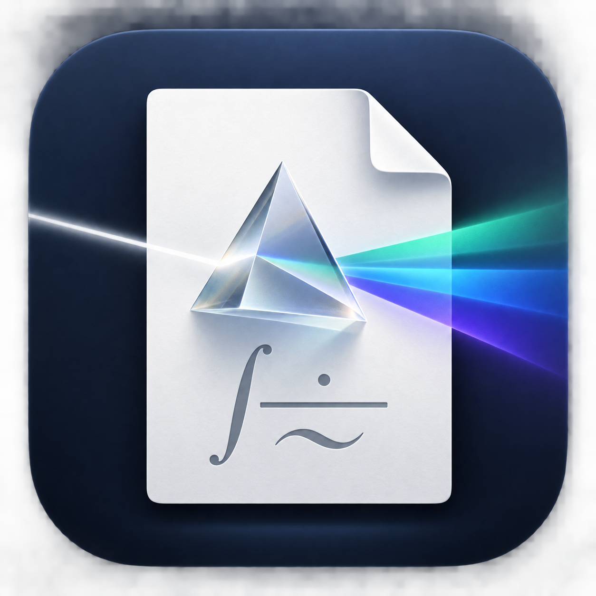

<p align="center">
  
</p>

<h1 align="center">Prism Plus</h1>

<p align="center">
  A local-first, native macOS LaTeX editor with IDE-grade editing and a stable live PDF preview.
</p>

> **Project status:** Prism Plus is a pre-1.0 prototype. Version 0.1.0 is available for testing,
> but it is ad-hoc signed and not notarized by Apple. Back up important documents before testing
> file-management features.

## Download Prism Plus for macOS

[**Download Prism Plus 0.1.0 for Apple silicon (.dmg)**](https://github.com/DamonLi2020/PrismPlus/releases/download/v0.1.0/PrismPlus-0.1.0-arm64.dmg)

This build requires an M-series Mac and macOS 14 or newer. It is an unnotarized preview, so macOS
will warn that Apple cannot verify the developer. After copying the app into Applications,
Control-click **Prism Plus**, choose **Open**, and confirm. If macOS still blocks it, verify the
[published SHA-256 checksum](https://github.com/DamonLi2020/PrismPlus/releases/download/v0.1.0/SHA256SUMS.txt),
then use **System Settings → Privacy & Security → Open Anyway**. Do not bypass Gatekeeper for a
copy obtained from another source.

Tectonic is included, so Homebrew and a separate LaTeX installation are unnecessary for this
download. Tectonic may access the network on first compilation to download TeX support files.

## What Prism Plus offers

- Native SwiftUI workspace with a VS Code-style activity rail and project explorer
- Embedded Monaco editor—the editing engine used by VS Code—available completely offline
- LaTeX syntax highlighting, command completion, snippets, bracket pairing, and keyboard-driven
  suggestions
- Conservative LaTeX-aware formatting, indentation, and wrapped prose
- Document outline with heading hierarchy and click-to-jump navigation
- Debounced Tectonic compilation that waits while a command or delimiter is incomplete
- Stable PDFKit preview that preserves page, zoom, and scroll position across recompiles
- Clickable compiler diagnostics with red and yellow source markers
- PDF download to the Downloads folder or export beside the active `.tex` document
- Inline file and folder creation, rename, reveal, and trash actions
- Local-first document handling and mandatory Tectonic untrusted mode

## Requirements

| Purpose | Requirement |
| --- | --- |
| Run a built app | macOS 14 or newer |
| Develop from source | Xcode 26 or newer |
| Generate the Xcode project | [XcodeGen](https://github.com/yonaskolb/XcodeGen) |
| Compile LaTeX in development | [Tectonic](https://tectonic-typesetting.github.io/) |
| Rebuild the embedded editor | Node.js 24 or newer |
| Build a shareable prototype | Apple-silicon Mac (M1 or newer) |

## Run from source

Install the development tools:

```sh
brew install xcodegen tectonic
```

Clone and open the project:

```sh
git clone https://github.com/DamonLi2020/PrismPlus.git
cd PrismPlus
xcodegen generate
open PrismPlus.xcodeproj
```

In Xcode, select the **PrismPlus** scheme and press **Run**. The generated Monaco assets are already
committed, so Node.js is unnecessary unless you plan to change the web editor.

## Use the editor

1. Start Prism Plus and choose **New Document**, **Open Document**, or **Open Project**.
2. Edit a `.tex` file in the source pane. Autocomplete appears after a backslash; use the arrow
   keys to navigate and Return or Tab to accept a suggestion.
3. Let the debounced compiler update the preview, or press Command-B to compile immediately.
4. Select a diagnostic to jump to its source line, or select an outline entry to navigate by
   document structure.
5. Use the preview export controls to download a PDF or create one beside the source file.

### Keyboard shortcuts

| Action | Shortcut |
| --- | --- |
| New document | Command-N |
| Open document | Command-O |
| Open project | Command-Shift-O |
| Save | Command-S |
| Compile | Command-B |
| Format document | Command-Shift-F |
| Show suggestions | Control-Space |

## Build and test

Run the native test suite:

```sh
xcodegen generate
xcrun swift-format lint --strict --recursive PrismPlus PrismPlusTests
xcodebuild test \
  -project PrismPlus.xcodeproj \
  -scheme PrismPlus \
  -destination 'platform=macOS'
xcodebuild build \
  -project PrismPlus.xcodeproj \
  -scheme PrismPlus \
  -destination 'platform=macOS'
```

When changing the embedded Monaco editor:

```sh
cd EditorWeb
npm ci
npm test
npm run build
```

The Vite build writes its generated assets directly into `PrismPlus/EditorResources`; commit those
updated assets with the TypeScript source.

## Build a friend prototype

On an Apple-silicon development Mac, run:

```sh
./scripts/package-prototype.sh
```

The script creates an arm64 Release build, bundles and relocates Tectonic, includes third-party
licenses, ad-hoc signs the app, verifies its signature, and produces a DMG, ZIP, and SHA-256
checksums under `dist/`.

The recipient needs an M-series Mac running macOS 14 or newer. Because the prototype is not Apple
notarized, they must Control-click **Prism Plus**, choose **Open**, and confirm the first launch.
Public binary distribution should wait for Developer ID signing, notarization, and a final
redistribution-license review.

## Architecture and security

Prism Plus uses SwiftUI and AppKit for its workspace, WebKit for the bundled Monaco editor, PDFKit
for previewing, and Tectonic for compilation. See [the architecture notes](docs/architecture.md)
for the component boundaries.

Documents are read and written locally. Editor assets load from the application bundle rather than
a CDN. Tectonic may access the network to download TeX support files on first use, then reuses its
local cache. Compilation launches Tectonic directly through `Process`—never through a shell—and
always supplies `--untrusted` plus `TECTONIC_UNTRUSTED_MODE=1`.

The application sandbox is currently disabled because the prototype project explorer works with
user-selected folders. Treat unexpected `.tex` files as untrusted even with compiler protections
enabled.

## Known limitations

- The project explorer intentionally opens only `.tex` files; other resources remain visible but
  disabled.
- Prototype packaging currently targets Apple silicon only.
- The downloadable preview is ad-hoc signed and not Apple-notarized.
- Tectonic may require internet access during the first compilation or when a new package is used.
- Multi-file LaTeX project intelligence is still being expanded.

## Contributing and feedback

Bug reports and focused feature suggestions are welcome through
[GitHub Issues](https://github.com/DamonLi2020/PrismPlus/issues). For bugs, include your Mac model,
macOS version, exact reproduction steps, expected behavior, actual behavior, and a screenshot when
useful.

Changes should follow the existing test-driven workflow: add a failing behavioral test, implement
the smallest complete change, refactor, then run the native and embedded-editor checks.

## Third-party software and project rights

Prism Plus includes Monaco Editor and packages prototype builds with Tectonic and its supporting
libraries. See [THIRD_PARTY_NOTICES.md](THIRD_PARTY_NOTICES.md) for attribution and license details.

No project-wide open-source license has been selected yet. Publishing the source makes it visible
for evaluation and feedback but does not grant additional rights beyond those required by the
third-party licenses.
